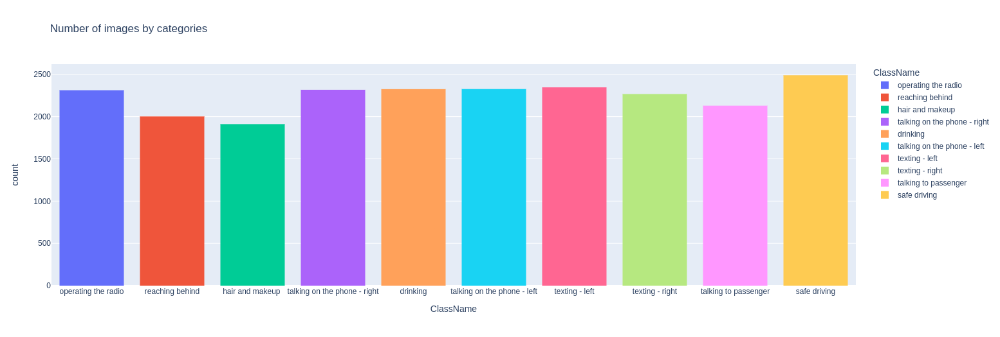
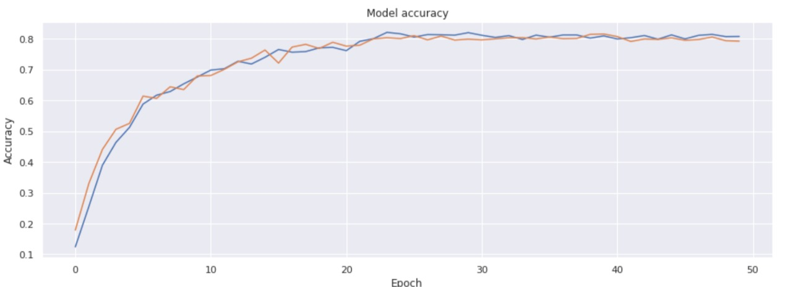
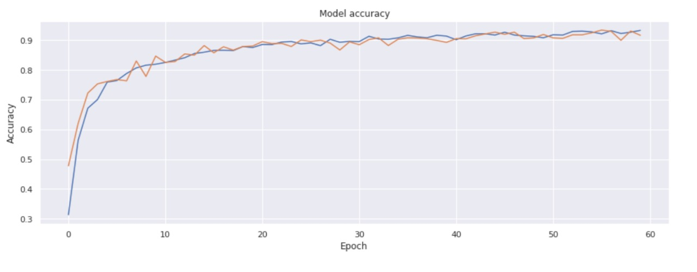
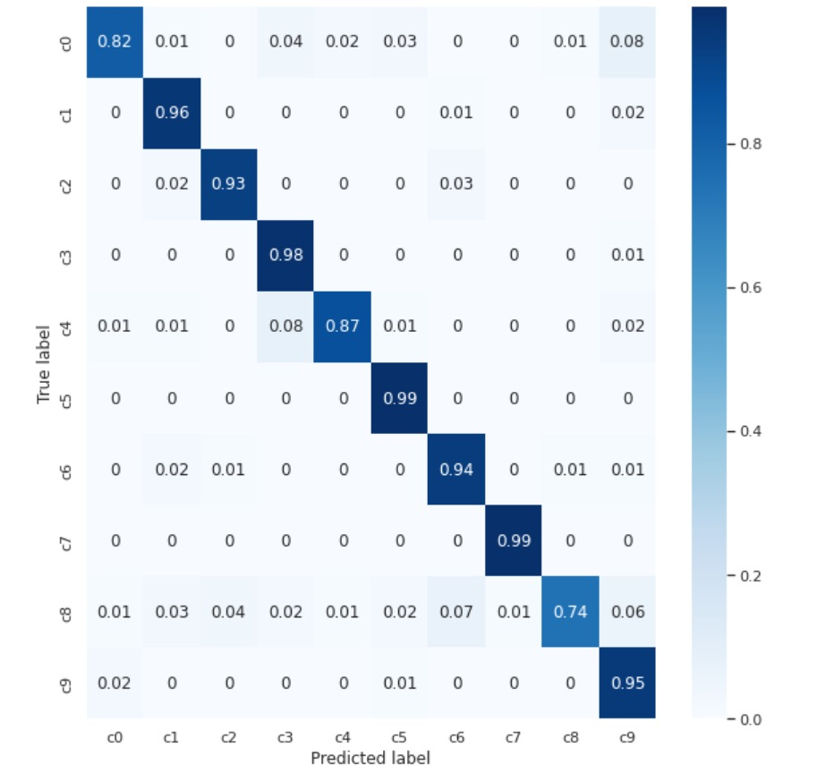

# Distracted Driver Detection
## Team Abraca-data
### CSE541 - Computer Vision, Ahmedabad University

## Introduction
Number of road accidents is continuously increasing in last few years worldwide. As per the survey of National Highway Traffic Safety Administrator, nearly one in five motor vehicle crashes are caused by distracted driver. We attempt to develop an accurate and robust system for detecting distracted driver and warn him against it. Motivated by the performance of Convolutional Neural Networks in computer vision, we present a CNN based system that not only detects the distracted driver but also identifies the cause of distraction. We unfreeze the last few layers of the ResNet50 model and perform data augementation and fine tune our hyperparameters to improve the performance of our model. We can infer that among various CNN models ResNet50 outperforms others with an accuracy of 90%.

## Results
For various algorithms, results are generated in a graphical form. Please have a look at the [report]https://github.com/Mananshi/CSE541-Computer-Vision-2022-Abraca-data/blob/main/Reports/Group_3_Abraca_data_End_Sem_Project_Report.pdf).

### EDA

##### Here is the Distribution of data among various classes

### VGG19 Results
#### Loss versus Epochs

### ResNet50 Results
#### Loss versus Epochs

#### Confusion Metrics

## References
- K. He, X. Zhang, S. Ren, and J. Sun, “Deep residual learning for image recognition,” in Proceedings of the IEEE conference on computer vision and pattern recognition, 2016, pp. 770–778.
- K. Simonyan and A. Zisserman, “Very deep convolutional networks for large-scale image recognition,” arXiv preprint arXiv:1409.1556, 2014.
- B. Baheti, S. Gajre, and S. Talbar, “Detection of distracted driver using convolutional neural network,” in 2018 IEEE/CVF Conference on Computer Vision and Pattern Recognition Workshops (CVPRW), 2018, pp. 1145–11 456.
- “State farm distracted driver detection.” [Online]. Available:
https: //www.kaggle.com/c/state-farm-distracted-driver-detection
- P. Canuma, “Image classification: Tips and tricks,” Nov 2021. [Online]. Available: https://neptune.ai/blog/ image-classification-tips-and-tricks-from-13-kaggle-competitions
